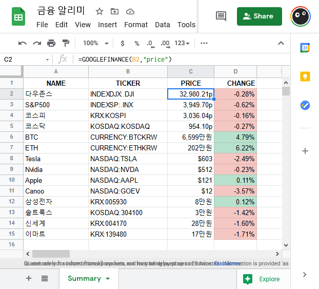

# finance-push

A serverless function that sends financial data from Google Sheets to Pushover at 8 a.m. GMT+9 every day.

The data is managed using the `GOOGLEFINANCE` function on the Google Sheet as shown below.

The AWS Lambda function sends this data daily to a push notification service webhook called Pushover for personal access.

It uses:

- Google Sheets (with Google Finance functions)
- Pushover(https://pushover.net)
